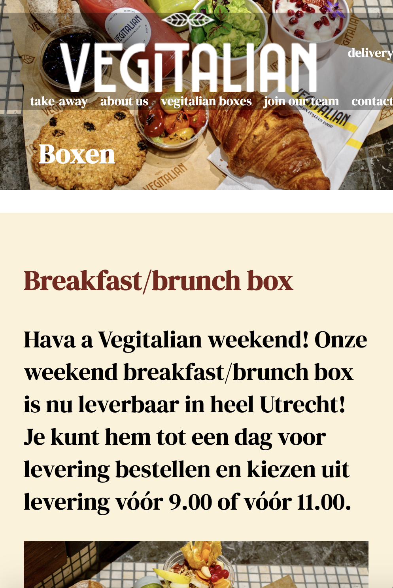
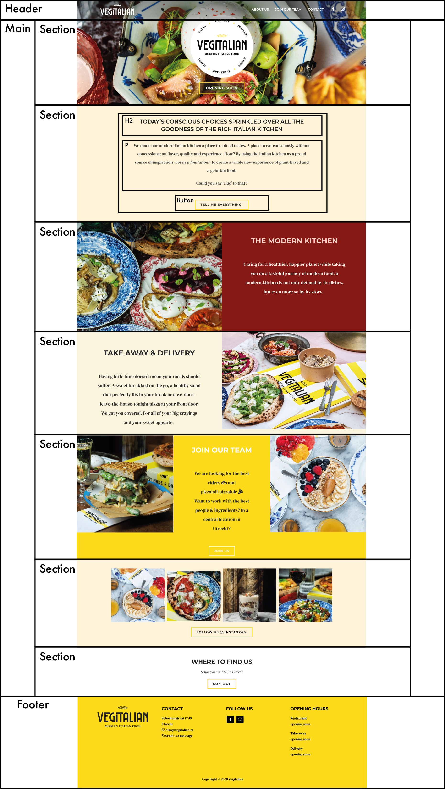

# Procesverslag
**Auteur:** Emma Ketzer 

Markdown cheat cheet: [Hulp bij het schrijven van Markdown](https://github.com/adam-p/markdown-here/wiki/Markdown-Cheatsheet). Nb. de standaardstructuur en de spartaanse opmaak zijn helemaal prima. Het gaat om de inhoud van je procesverslag. Besteedt de tijd voor pracht en praal aan je website.

## Bronnenlijst
1.<b>Flexbox:</b> https://css-tricks.com/snippets/css/a-guide-to-flexbox/
2.<b>Hamburger menu:</b> ljc-dev. (2020, 26 juli). Easy hamburger menu with JS. DEV. https://dev.to/ljcdev/easy-hamburger-menu-with-js-2do0
3.<b>Scroll event:</b> Online Tutorials. (2020, 21 februari). Sticky Navigation Bar On Scroll Using Vanilla Javascript | Fixed Navbar on Scroll [Video].                      YouTube. https://www.youtube.com/watch?v=6HFpw5fcaD8
4.<b>Iconen:</b> Business Person Emoji. (z.d.). [Illustratie]. emojirequest. https://www.emojirequest.com/r/BusinessPersonEmoji
           iconscout. (z.d.). Take Away [Illustratie]. Iconscout. https://iconscout.com/icon/take-away-1851579
           Freepik. (z.d.-a). Pizza free icon [Illustratie]. Freepik. https://www.flaticon.com/free-icon/pizza_3132693
5.<b>Beelden:</b> https://vegitalian.nl/
6.<b>Animaties: </b>Powerpoint uit de les.
7. https://www.youtube.com/watch?v=33IinMVJf-M&t=162s

## Eindgesprek (week 7/8)

<b>Wat ging goed en wat was lastig?</b> 
 
Wat ik tijdens deze opdracht vooral lastig vond, was het toevoegen van Javascript. Ik ben niet heel goed in Javascript, maar uiteindelijk is het mij wel gelukt om een inklapbaar hamburger menu toe te voegen. Ook is het gelukt om de menubalk van kleur te laten veranderen bij het scrollen. 

Het toevoegen van animaties ging best goed en ik vond dit ook leuk om te doen.
Het opzetten van de html en css ging over het algemeen ook erg goed! Sommige dingen hadden misschien wat beter gekund zoals de ingevoerde Google Maps kaart. Het is mij helaas niet gelukt om deze over de gehele breedte te krijgen. Toch ben ik erg tevreden met het eindresultaat en heb ik veel geleerd tijdens Frontend.

**Screenshot(s):**

-screenshot(s) van je eindresultaat-

## Voortgang 3 (week 6)

<b>Dit ging goed:</b> 
Het toevoegen van animaties ging best goed. Ook het verder uitwerken van de tweede pagina ging goed. 

<b>Dit was lastig:</b>
Ik vind Javascript nog steeds erg lastig, maar dit gaat wel langzaam steeds beter.

<b>Vragen:</b>
1 Hoe zorg ik ervoor dat de menubalk van kleur veranderd wanneer je gaat scrollen?

## Voortgang 2 (week 5)
### Stand van zaken
<b>Dit ging goed:</b> 
De basis html en css, het opzetten van de tweede pagina.
Ook ging het verwerken van de feedback goed. 

<b>Dit was lastig:</b>
Javascript vind ik wat lastiger, daar ga ik volgende week mee aan de slag. 
Ook lukt het nog niet om een hamburgermenu toe te voegen. 

<b>Vragen:</b>
1 Aan de bovenkant van de pagina zit een kleine ruimte, maar ik heb geen idee hoe dit komt en hoe ik dit dus kan aanpassen. 
 
2 Wat is de makkelijkste manier om een hamburger menu toe te voegen?
 
3 Hoe zorg ik ervoor dat de menubalk van kleur veranderd wanneer je gaat scrollen?

**Screenshot(s):**

## Voortgang 1 (week 3)

### Stand van zaken

<b>Dit ging goed:</b> 
De basis html en css van de pagina opzetten.  

<b>Dit was lastig:</b>
Flexbox en positioneren vind ik nog een beetje lastig.  

Vragen:
1 Hoe kun je het beste een achtergrondafbeelding aan een section toevoegen? In de eerste section moet een achtergrondafbeelding komen en deze moet doorlopen tot de bovenkant van de pagina. Hij moet dus onder de menubalk doorlopen.
 
2 Hoe zorg ik ervoor dat de menubalk van kleur veranderd wanneer je gaat scrollen?

**Screenshot(s):**

### Agenda voor meeting

-samen met je groepje opstellen-

| student 1      | student 2          | student 3    | student 4        |
| ---            | ---                | ---          | ---              |
| dit bespreken  | en dit             | en ik dit    | en dan ik dat    |
| an dat ook nog | dit als er tijd is | nog een punt | dit wil ik zeker |
| ...            | ...                | ...          | ...              |

### Verslag van meeting

-na afloop snel uitkomsten vastleggen-

## Breakdownschets (week 1)

## Intake (week 1)

**Je startniveau:** Blauwe piste

**Je focus:** Extra aandacht voor de surfacelaag

**Je opdracht:** https://vegitalian.nl/

**Screenshot(s) van de eerste pagina (small screen):**

**Screenshot(s) van de tweede pagina (small screen):**

